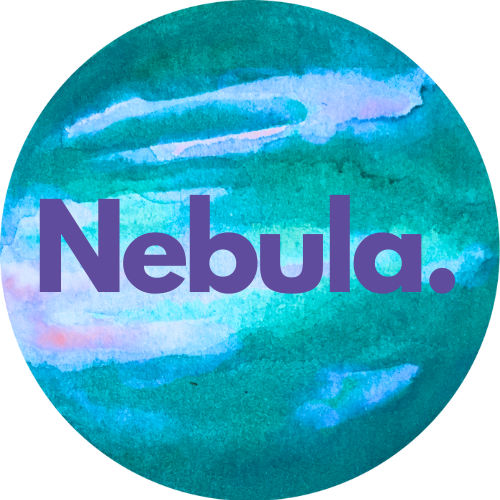

# 💰 Nebula - Personal Finance Tracker

<p align="center">
  
</p>

<p align="center">
  <strong>A modern, feature-rich personal finance management application built with Next.js</strong>
</p>

<p align="center">
  
  
  
  
  
  
  
  
</p>

## 🌟 Features

### 📊 **Interactive Dashboard**
- Real-time financial overview with beautiful charts and graphs
- Monthly transaction history visualization
- Income vs Expense tracking with visual indicators
- Responsive design that works on all devices

### 🏷️ **Custom Categories**
- Create unlimited custom categories for income and expenses
- Icon-based category system for easy identification
- Category-wise transaction filtering and analysis
- Color-coded category management

### 💸 **Transaction Management**
- Quick transaction creation with intuitive forms
- Support for both income and expense transactions
- Date-based transaction organization
- Detailed transaction history with search and filter capabilities

### 📈 **Financial Analytics**
- Monthly spending patterns and trends
- Category-wise expense breakdown
- Visual charts and graphs for better insights
- Historical data tracking and comparison

### 🎨 **Modern UI/UX**
- Clean, intuitive interface built with shadcn/ui components
- Dark/Light theme support with system preference detection
- Smooth animations and transitions
- Mobile-first responsive design

### 🔐 **Secure Authentication**
- Clerk-powered authentication system
- Secure user session management
- Protected routes and API endpoints
- Multi-provider authentication support

### 💱 **Multi-Currency Support**
- Support for multiple currencies
- Currency conversion and formatting
- Localized number formatting
- Easy currency switching

## 🛠️ Tech Stack

### **Frontend**
- **Next.js 15.2** - React framework with App Router
- **React 19** - UI library with latest features
- **TypeScript** - Type-safe development
- **TailwindCSS** - Utility-first CSS framework
- **shadcn/ui** - Beautiful, accessible UI components
- **Lucide React** - Modern icon library

### **Backend & Database**
- **Prisma** - Type-safe database ORM
- **SQLite** - Lightweight database for development
- **Server Actions** - Next.js server-side functions

### **State Management & Data Fetching**
- **Tanstack Query** - Powerful data synchronization
- **React Hook Form** - Performant form management
- **Zod** - Runtime type validation

### **Authentication**
- **Clerk** - Complete authentication solution
- **Middleware** - Route protection and auth handling

### **Development Tools**
- **ESLint** - Code linting and quality
- **PostCSS** - CSS processing
- **TypeScript** - Static type checking

## 🚀 Getting Started

### Prerequisites
- Node.js 18+ 
- npm, yarn, pnpm, or bun

### Installation

1. **Clone the repository**
   ```bash
   git clone https://github.com/viraj-ap/nebula.git
   cd nebula
   ```

2. **Install dependencies**
   ```bash
   npm install
   ```

3. **Set up environment variables**
   ```bash
   cp .env.example .env.local
   ```
   
   Fill in your environment variables:
   ```env
   NEXT_PUBLIC_CLERK_PUBLISHABLE_KEY=your_clerk_publishable_key
   CLERK_SECRET_KEY=your_clerk_secret_key
   DATABASE_URL="file:./dev.db"
   ```

4. **Set up the database**
   ```bash
   npx prisma generate
   npx prisma db push
   ```

5. **Run the development server**
   ```bash
   npm run dev
   ```

6. **Open your browser**
   Navigate to [http://localhost:3000](http://localhost:3000) to see the application.

## 📱 Usage

### First Time Setup
1. **Sign up/Sign in** using the authentication system
2. **Complete the wizard** to set up your preferred currency and initial categories
3. **Create your first transaction** to start tracking your finances

### Daily Usage
- **Add transactions** quickly through the dashboard
- **Monitor spending** with real-time charts and graphs
- **Manage categories** to organize your finances
- **View reports** to understand your financial patterns

##  Project Structure

```
nebula/
├── app/                    # Next.js App Router
│   ├── (auth)/            # Authentication pages
│   ├── (pages)/           # Main application pages
│   │   ├── dashboard/     # Dashboard with components and actions
│   │   ├── manage/        # Category management
│   │   └── transactions/  # Transaction history
│   ├── api/               # API routes
│   └── wizard/            # Initial setup wizard
├── components/            # Reusable UI components
│   └── ui/               # shadcn/ui components
├── hooks/                # Custom React hooks
├── lib/                  # Utility functions and configurations
├── prisma/               # Database schema and migrations
├── schema/               # Zod validation schemas
└── public/               # Static assets
```

## 🤝 Contributing

1. Fork the repository
2. Create your feature branch (`git checkout -b feature/amazing-feature`)
3. Commit your changes (`git commit -m 'Add some amazing feature'`)
4. Push to the branch (`git push origin feature/amazing-feature`)
5. Open a Pull Request


---

<p align="center">
  Made with ❤️ by Viraj :)
</p>
